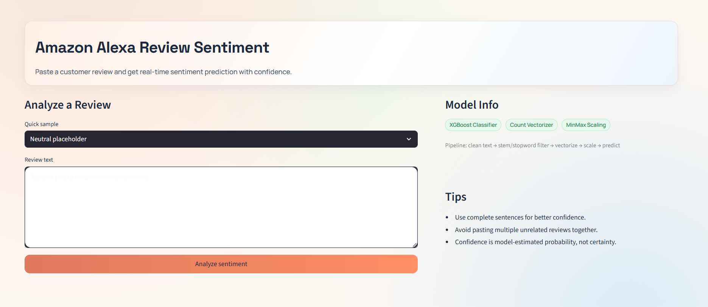
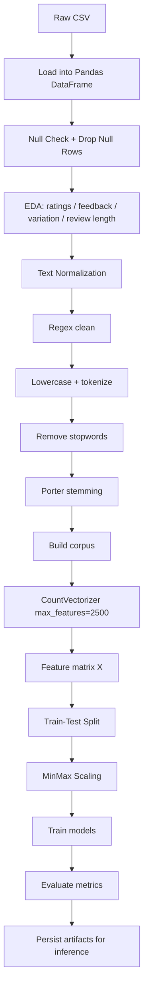
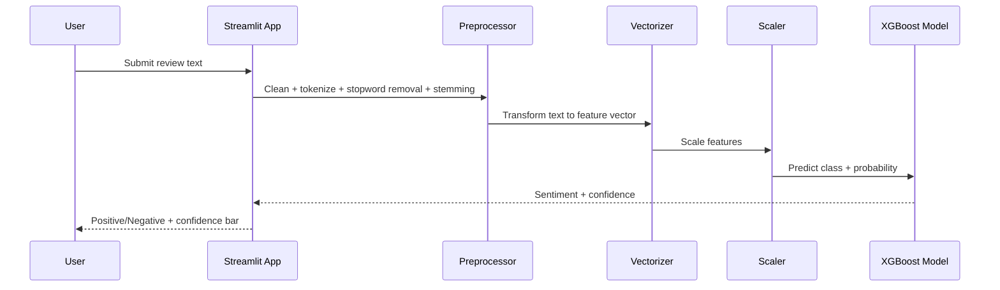

# Amazon Review Sentiment Analysis

<p align="center">
  <b>NLP + ML + Streamlit</b><br/>
  Predict sentiment from Amazon Alexa reviews with a polished, modern web interface.
</p>

<p align="center">
  
  
  
  
</p>



## Overview

This project performs end-to-end sentiment analysis on Amazon Alexa reviews.
It starts with EDA and preprocessing in a notebook, trains multiple classifiers, and deploys the final model in a clean Streamlit app.

## What Makes It Stand Out

- End-to-end workflow from raw data to deployed UI
- Reusable model artifacts saved for inference
- Consistent preprocessing between training and app prediction
- Modern app design with confidence feedback and quick sample inputs

## Core Pipeline

1. Load and clean review data from `amazon_alexa.csv`
2. Normalize text with regex, lowercasing, stopword removal, and stemming
3. Convert text to numerical features using `CountVectorizer(max_features=2500)`
4. Scale features with `MinMaxScaler`
5. Train and compare multiple models (Random Forest, XGBoost, Decision Tree)
6. Save final artifacts and serve predictions with Streamlit

## Technical Deep Dive

## System Flow (Diagram)


## Data Pipeline (Flowchart)



## Inference Pipeline (App Runtime)



## Data Pipeline Explanation

This project uses a two-stage pipeline:

1. Offline training pipeline in notebook:
- Reads `amazon_alexa.csv` and performs data cleaning/EDA.
- Converts review text into normalized tokens.
- Generates numeric features with Bag-of-Words (`CountVectorizer`).
- Applies feature scaling (`MinMaxScaler`).
- Trains and evaluates multiple models, then exports selected artifacts.

2. Online inference pipeline in app:
- Loads exported artifacts once and caches them.
- Applies exactly the same text preprocessing steps used in training.
- Transforms incoming text with fitted vectorizer and scaler.
- Runs final XGBoost model to return sentiment and confidence.

This training-serving parity prevents feature mismatch and keeps production predictions consistent with notebook evaluation.

### Data and Labeling

- Source file: `amazon_alexa.csv`
- Target variable: `feedback` (binary)
  - `1` -> positive sentiment
  - `0` -> negative sentiment
- Text column used for modeling: `verified_reviews`

### Text Preprocessing

Preprocessing is intentionally lightweight and deterministic for stable inference:

1. Regex cleanup with `re.sub("[^a-zA-Z]", " ", text)` to remove non-alphabetic characters
2. Lowercasing + tokenization by whitespace split
3. Stopword filtering using NLTK English stopwords
4. Stemming via `PorterStemmer`
5. Rejoin tokens into normalized sentence for vectorization

The same logic is reused in both training and app inference to avoid train/serve skew.

### Feature Engineering

- Vectorizer: `CountVectorizer(max_features=2500)`
- Output transformed to dense vector for downstream scaling/model input
- Feature scaling: `MinMaxScaler` to normalize feature ranges before model fitting

Artifacts persisted to disk:

- `Models/count_vectorizer.pkl`
- `Models/scaler.pkl`

### Modeling Strategy

Three classifiers are trained and compared:

- Random Forest: robust baseline for tabularized sparse-ish vectors
- XGBoost: boosted trees for stronger non-linear decision boundaries
- Decision Tree: interpretable reference model

Final model used in app:

- `XGBClassifier` saved as `Models/xgboost_classifier.pkl`

### Train/Test Protocol

- Split: `train_test_split(test_size=0.3, random_state=15)`
- Validation support in notebook:
  - K-fold cross-validation (`cross_val_score`)
  - Hyperparameter search (`GridSearchCV` + `StratifiedKFold`)

### Evaluation Metrics

Model quality is assessed using:

- Accuracy
- Confusion matrix
- Precision
- Recall
- F1-score
- Full classification report

### Inference Architecture (App Runtime)

For each user input in Streamlit:

1. Load serialized artifacts (cached with `@st.cache_resource`)
2. Apply exact preprocessing function
3. Transform with fitted vectorizer
4. Scale with fitted scaler
5. Predict class with fitted XGBoost model
6. If supported, return `predict_proba` confidence

This ensures the live app mirrors notebook preprocessing and feature space.

### Complexity and Practical Notes

- Bag-of-words inference is fast and suitable for real-time UI prediction
- Memory cost depends on dense conversion from vectorized features
- Stemming may reduce interpretability of displayed tokens but improves normalization
- Confidence score is probabilistic model output, not calibrated certainty

## Tech Stack

| Layer | Tools |
|---|---|
| Language | Python |
| Data | Pandas, NumPy |
| NLP | NLTK |
| ML | Scikit-learn, XGBoost |
| Visualization | Matplotlib, Seaborn, WordCloud |
| App | Streamlit |

## Project Structure

```text
.
├── Sentiment Analysis on Amazon Reviews.ipynb
├── app.py
├── requirements.txt
├── amazon_alexa.csv
├── Models/
│   ├── count_vectorizer.pkl
│   ├── scaler.pkl
│   └── xgboost_classifier.pkl
├── Image/
│   └── AppImg.png
└── img/
    └── AppImg.png
```

## Quick Start

```bash
git clone https://github.com/akriti-e/Sentiment-Analysis-on-Amazon-Reviews-NLP.git
cd "Sentiment Analysis on Amazon Reviews - NLP"
pip install -r requirements.txt
streamlit run app.py
```

## App Experience

- Pastel UI with strong readability
- Dark typography for clarity
- One-click sample review testing
- Sentiment output with confidence indicator
- Low-confidence warning zone for uncertain predictions

## Saved Artifacts

The app uses these pre-trained files at runtime:

- `Models/count_vectorizer.pkl`
- `Models/scaler.pkl`
- `Models/xgboost_classifier.pkl`

If missing, run the notebook end-to-end once to regenerate them.

## Evaluation Included

- Accuracy comparison across models
- Confusion matrices
- Precision, Recall, F1-score
- Classification report

## Reproducibility Notes

- Keep `requirements.txt` pinned and install in a clean environment
- Regenerate model artifacts by running the notebook top-to-bottom
- Do not mix artifacts from different training runs unless all three files are regenerated together
- If app predictions look inconsistent, verify preprocessing code parity between notebook and `app.py`

## Next-Level Upgrades

- Batch CSV prediction export
- Explainability layer (important token contribution)
- CI checks for app + preprocessing
- Dockerized deployment flow

## Author

Built by **Akriti** with a practical focus on deployable NLP.
